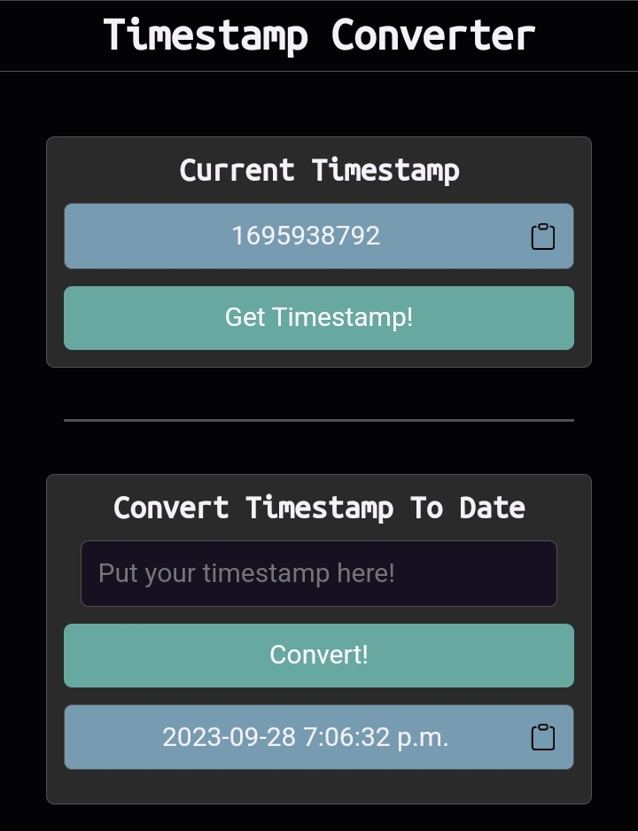

  

  <h3 align="center">Timestamp Converter</h3>

  

    A simple timestamp converter
     
     
    <a href="https://harukayamamoto0.github.io/timestamp-converter/">View Demo</a>
    ·
    <a href="https://github.com/HarukaYamamoto0/timestamp-converter/issues">Report Bug</a>
    ·
    <a href="https://github.com/HarukaYamamoto0/timestamp-converter/issues">Request Feature</a>
  

## About The Project

The Timestamp Generator and Converter simplifies the task of handling timestamps by providing an intuitive interface for both generating current timestamps and converting them into readable dates.

## Screenshot

## License

Distributed under the MIT License. See `LICENSE` for more information.

## Flaticon
<a href="https://www.flaticon.com/free-icons/timestamp" title="timestamp icons">Timestamp icons created by Iconjam - Flaticon</a>
